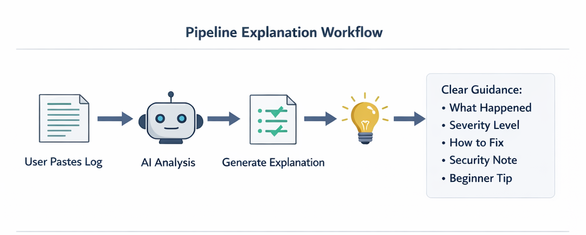
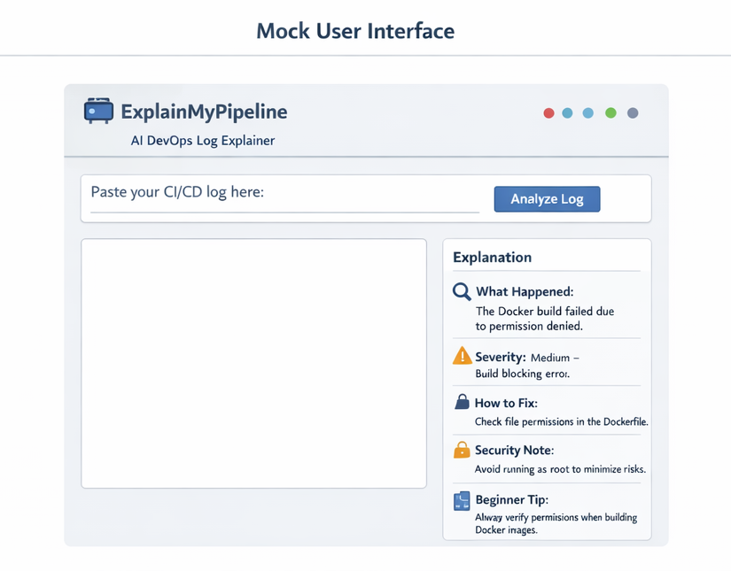

# ExplainMyPipeline – AI DevOps & DevSecOps Mentor

## Problem Statement
DevOps beginners and junior engineers struggle to understand CI/CD failures, Docker errors, and system logs. Existing tools are designed for experts and focus on dashboards rather than clear explanations.

## Solution
ExplainMyPipeline is an AI-powered mentoring tool that converts DevOps logs into plain-language explanations, severity levels, safe fixes, and security-aware guidance.

## How It Works
1. User pastes a DevOps log or error
2. AI analyzes the input
3. Structured output is generated:
   - What happened
   - Severity
   - How to fix
   - Security note
   - Beginner tip

## Current Status
This repository contains an early-stage prototype demonstrating:
- Sample DevOps logs
- Expected AI-generated explanations
- Gemini prompt design

Backend and UI integration are planned as future work.

## Target Users
- DevOps beginners
- Students
- Junior engineers
- DevSecOps learners

## Future Enhancements
- Web-based interface
- Live Gemini API integration
- Support for more CI/CD tools

## Setup Instructions
### 1. Clone the repository
git clone https://github.com/jashuboy/ExplainMyPipeline.git
cd ExplainMyPipeline

### 2. Install dependencies
pip install -r requirements.txt

### 3. Set Gemini API key

Windows:
set GEMINI_API_KEY=your_api_key_here

Mac/Linux:
export GEMINI_API_KEY=your_api_key_here

### 4. Run the app
python app.py

Open browser:
http://127.0.0.1:5000

## Architecture & Workflow

## Sample Log Input & AI Output

## Mock User Interface

